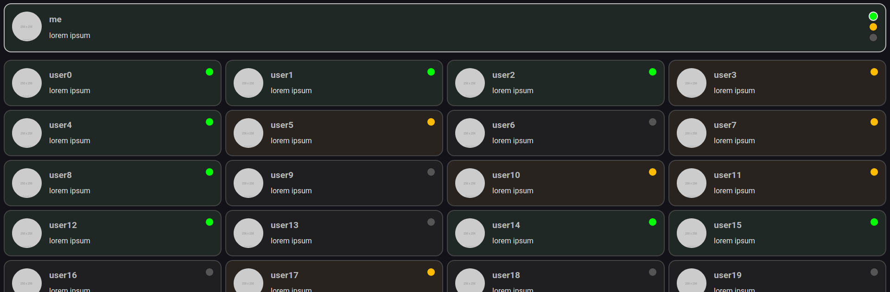

# statuses

A frontend for a backend that never got written; demonstrates knowledge of
modern CSS tools, JS frameworks, and TypeScript.

Screenshot with mocked backend:

## Functionality

This project implements an interface for an "ephemeral" messaging platform:
instead of a message history, each user has exactly one message that they edit
in response to other changes. The client expects a WebSocket backend responding
to JSON, and can send and receive updates to user statuses and messages.
